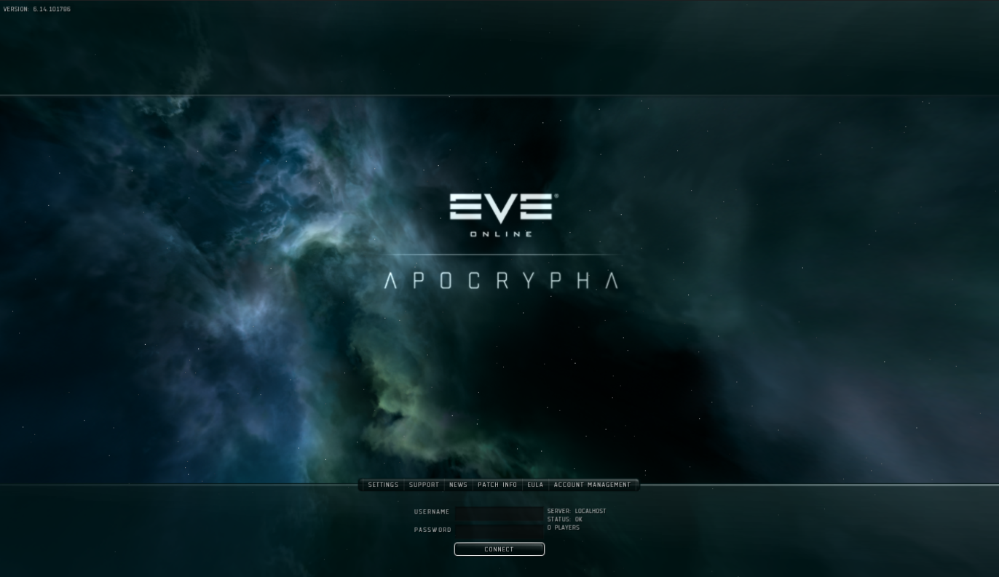

# Server setup
Before anything has to be done on the client-side of things the server must be setup, the following steps explain how to setup the database and the server binaries to accept incoming connections from clients.

## Database setup
The first thing to do is setup the MariaDB Database for the server. Assuming there is a MariaDB server already installed, the first thing to do is create a database and a user for the emulator. Open a MariaDB connection to the server and run the following queries:
```
CREATE DATABASE evedb;
CREATE USER 'evesharp'@'localhost' IDENTIFIED BY 'passwordhere';
GRANT ALL PRIVILEGES ON evedb.* TO 'evesharp'@'localhost';
```
**IMPORTANT: Change the *passwordhere* to a proper password to ensure your database is secure. You might also need to change the 'localhost' to something different if your Cluster and Nodes do not run on the same machine as the MariaDB server. Refer to the MariaDB documentation to learn more**

This will create the database "evedb" and the user "evesharp" for accessing the database with the given password.

Once the database is created, generate the .sql files to be imported into the database. Under the directory "Database/Utils" are two scripts called "Merge-Oficial" and "Merge-Server". Depending on the OS you are running you'll need to run the .sh or the .bat versions of them. (.bat is for Windows, .sh for any Unix-like system).

These scripts will generate two .sql files named "Server.sql" and "Official.sql" on the "Database" directory. These files will be used during the following steps to import into the database.

Once everything is generated the only thing left is to perform the static data dump import. Extract the ```apo15-mysql5-v1.sql.bz2``` file into the "Database" directory. This should create an sql file ```apo15-mysql5-v1.sql```. This file has to be imported first, followed by the emulator's SQL files:
```
source apo15-mysql5-v1.sql;
source Oficial.sql;
source Static.sql;
source Dynamic.sql;
source Server.sql;
source Prime.sql;
```

With this the database should be ready.

## Server setup
Once the database is properly setup, you need to compile the project. Due to how EVESharp is designed there are two projects that we care about: **ClusterController** and **Node**. Open the file EVESharp.sln under the "Server" folder with your preferred C# development IDE and build the whole solution. This will generate the binaries with the server's code. 

If everything went right there should be a new folder under each solution's project named "bin" and inside that a folder called Debug or Release based on the build configuration selected. Inside those folders you'll find the server's files.

Due to the way EVESharp is architected, the server is separated in two pieces. On one side there is the **ClusterController** which contains the Proxy code. This executable takes care of receiving client data, parsing it and sending to the proper node server to be processed.
On the other side, there is the **Node** which contains the actual server logic. This executable takes care of processing the client's requests and sending back information. 

The ideal server architecture is:
 - **ClusterController** is accessible on port 26000 through the network for clients to connect, this will be the public-facing service.
 - One or more **Node**, not accessible through the public network, ideally these would be on separate machines, but can be run alongside **ClusterController** if the load is low enough, it will comunicate with the clients through **ClusterController** 

### Configuring the **ClusterController**
[For information on all the configuration options of ClusterController click here](ClusterController/Configuration.md)

The minimal configuration file for the ClusterController must have information of the database where the game's data is stored and where to store the logs of the server (this last part is not a must, but will be a good way of debugging and reporting issues to the project). The options should be self-explanatory enough, but there is documentation on all of them [here](ClusterController/Configuration.md). This file has to be named ```configuration.conf``` and be alongside the ClusterController executable.
```
[database]
username=evesharp
password=passwordhere
hostname=localhost
name=evedb

[logfile]
directory=logs
logfile=ClusterController.log
```

**If you want to enable automatic account registration check the [configuration options](ClusterController/Configuration.md).**

### Configuring the **Node**
[For information on all the configuration options of Node click here](Node/Configuration.md)

The nodes require some more configuration in order to properly work. This is the minimal configuration file for it. Most of the options should be self-explanatory enough, but there is documentation on all of them [here](Node/Configuration.md). This file has to be named ```configuration.conf``` and be alongside the Node executable.
```
[database]
username=evesharp
password=passwordhere
hostname=localhost
name=evedb

[proxy]
hostname=127.0.0.1
port=26000

[authentication]
loginMessageType=MESSAGE
loginMessage=Welcome to EVESharp Debug Build

[logfile]
directory=logs
logfile=ClusterController.log
```

## Running the server
Once both the ClusterController and at least a Node is setup, the executables can be run. Before running any **Node** the **ClusterController** has to be up and listening for connections, It's output should look something like this:
```
18/2/20 11:20 I main: Initializing EVESharp Cluster Controler and Proxy
18/2/20 11:20 F main: Initializing EVESharp Cluster Controler and Proxy
18/2/20 11:20 E main: Initializing EVESharp Cluster Controler and Proxy
18/2/20 11:20 W main: Initializing EVESharp Cluster Controler and Proxy
18/2/20 11:20 D main: Initializing EVESharp Cluster Controler and Proxy
18/2/20 11:20 T main: Initializing EVESharp Cluster Controler and Proxy
18/2/20 11:20 T main: Initializing server socket on port 26000...
18/2/20 11:20 D main: Waiting for incoming connections on port 26000
```

Until there is at least a **Node** connected the server will appear online to game clients, but will refuse any login tries with a message of "Cluster starting".

Now run the first **Node**. The startup of a Node is a bit slower as it has to generate cache for the client and load all the item types from the database. The last few lines of log after startup should look like this:
```
18/2/20 11:28 D main: Done
18/2/20 11:28 I main: Initializing item factory
18/2/20 11:28 D main: Done
18/2/20 11:28 I main: Initializing solar system manager
18/2/20 11:28 D main: Done
18/2/20 11:28 I main: Initializing service manager
18/2/20 11:28 D main: Done
18/2/20 11:28 I main: Connecting to proxy...
18/2/20 11:28 T main: Node startup done
18/2/20 11:28 D ClusterConnection: Found machoNet.nodeInfo, our new node id is FFAA
```

**Congratulations, you are now running an EVESharp instance with at least one node**

# Client setup
Once the server is properly setup the only thing left is to prepare the client to connecto to whatever server we want to. 

## Patching blue.dll
First of all we need to patch the blue.dll checks. This file performs some checks on the game files to ensure no one has tampered with them, this includes the .ini files in the game directory, which indicate the server it will connect to, protocol used, etc... If any change is detected it just closes the game.

To perform this patch, place the BlueAutoPatcher.exe in the "bin" folder of the game and run it once. You should see a black screen and a success message. If that was right the blue.dll is patched and ready.

## Modifying configuration files
EVE Online uses two configuration files to determine to what server to connect and what protocol to use, so once the game is patched open the file ```start.ini```. Here we are interesed in modifying the "server" key. In the "server" key write the server's IP. 
```
[main]
role=client
aid=0
server=localhost
port=26000
edition=premium
```

Save the file and now open the ```common.ini``` file. Here the interesting value is the ```cryptoPack``` key, by default the value is ```CryptoAPI``` but that doesn't work with EVESharp as It requires encryption to be supported. To prevent the usage of encryption, change the value to ```Placebo``` as in this example:
```
[main]
version=6.14
build=101786
codename=EVE-EVE-RELEASE
region=ccp
cryptoPack=Placebo
sync=101786
branch=//depot/games/EVE-RELEASE/eve
appname=EVE
useScriptIndexFiles=1
```

Save the file. Now the client is completely setup and you should be able to connect to it properly.



If you have the [auto account option](ClusterController/Configuration.md) enabled in your ClusterController, you now will be able to create an account with a simple login try on the client.

From here on the game should progress as normal as long as the features you're using are supported. As It stands right now, only the station view works.